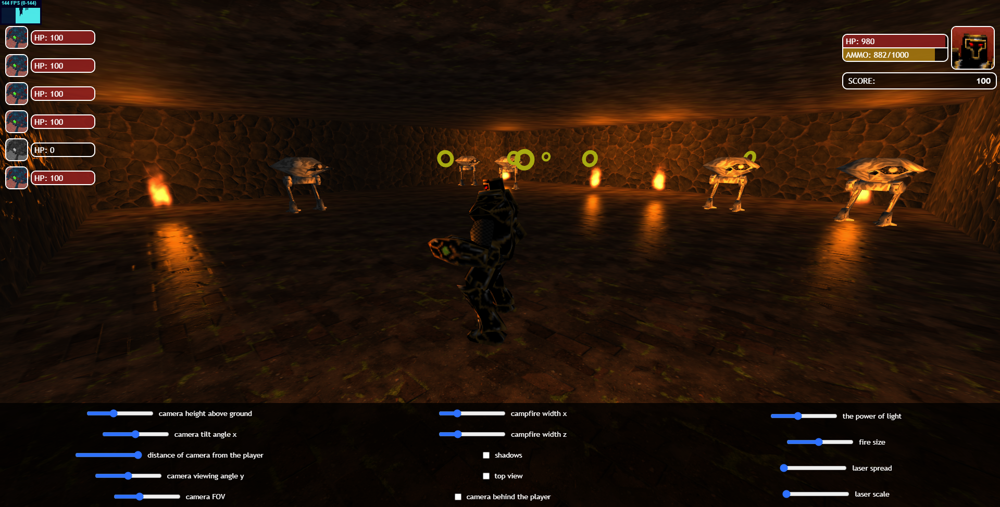

# Threejs-Shooter
Simple 3D game

##  Overall info

We create a level in the editor and upload it to the server.

Then in the launched client project we can load our level

The aim is to defeat all opponents

## Installation

 - Clone/download the repository
 - In `\Server` run Kotlin sparkserver file `\src\main\kotlin\sparkserver\App.kt` on default port 5000 (by e.g. InelliJ IDEA)
 - In `\Client`:
   - In terminal `run npm i` to install dependencies
   - In the terminal `run npm run go` to run project on webpack server (default port 8080)
    

## Features

- Map Editor
- Leaderboard
- 3D Models
- Aniamtions
- Score system
- Particles
- Lights and Shadows
- Textures
- Shooting
- Possibility to change camera settings

## Controls

- WASD - player movement
- Space - laser shooting

